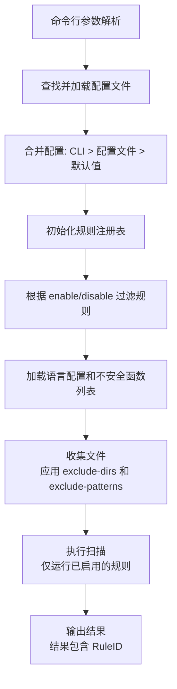

# go-grepper v2.0

## 一、概述

go-grepper v2.0 主要实现两个目标：

1. **统一规则命名体系**：为所有内置分析规则设计统一的规则 ID 命名规范，并新增 `rules` 命令输出所有规则列表
2. **配置文件支持**：支持通过 YAML 配置文件配置扫描行为，包括扫描语言、启用/禁用规则、过滤目录等

---

## 二、目标一：统一规则命名与规则列表命令

### 2.1 规则命名规范

#### 命名格式

```
<语言前缀>-<规则类别>-<序号>
```

- **语言前缀**：`GEN`（通用）、`CPP`、`JAVA`、`CS`（C#）、`VB`、`PHP`、`PLSQL`、`COBOL`、`R`
- **规则类别**：见下方类别定义
- **序号**：三位数字，同类别内递增，如 `001`、`002`

#### 规则类别定义

| 类别缩写 | 含义 | 说明 |
|---------|------|------|
| `SQLI` | SQL 注入 | SQL Injection |
| `XSS` | 跨站脚本 | Cross-Site Scripting |
| `CMDI` | 命令注入 | Command Injection |
| `BUFOV` | 缓冲区溢出 | Buffer Overflow |
| `MEMLK` | 内存泄漏 | Memory Leak |
| `CRYPTO` | 加密安全 | Cryptography Issues |
| `RAND` | 随机数安全 | Randomisation Issues |
| `AUTH` | 认证授权 | Authentication/Authorization |
| `PRIV` | 权限问题 | Privilege Issues |
| `TMPF` | 临时文件 | Unsafe Temp Files |
| `RACE` | 竞态条件 | Race Condition (TOCTOU) |
| `SERIAL` | 序列化 | Serialization Issues |
| `INTOV` | 整数溢出 | Integer Overflow |
| `SIGN` | 符号问题 | Signed/Unsigned Issues |
| `LOG` | 日志安全 | Log Security |
| `REDIR` | 重定向 | HTTP Redirect |
| `CONF` | 配置安全 | Configuration Security |
| `FILE` | 文件操作 | File Access/Inclusion |
| `RESRC` | 资源管理 | Resource Management |
| `MISC` | 其他 | Miscellaneous |
| `PASSWD` | 密码安全 | Password Security |
| `COMMENT` | 注释检查 | Suspicious Comment |
| `BADFUNC` | 不安全函数 | Unsafe Function (from .conf) |
| `NET` | 网络安全 | Network Security |
| `DATA` | 数据安全 | Data Security |
| `INPUT` | 输入验证 | Input Validation |

### 2.2 完整规则清单

#### 2.2.1 通用规则（GEN）

适用于所有语言的通用检查规则。

| 规则 ID | 规则名称 | 严重级别 | 来源 | 说明 |
|---------|---------|---------|------|------|
| `GEN-PASSWD-001` | Hardcoded Password | Medium | `scanner.go:checkHardcodedPassword` | 检测硬编码密码 |
| `GEN-COMMENT-001` | Suspicious Comment | Info | `CommentChecker.Check` | 注释中包含可疑关键词（TODO/FIXME等） |
| `GEN-COMMENT-002` | Comment Contains Password | High | `CommentChecker.Check` | 注释中包含密码信息 |
| `GEN-BADFUNC-001` | Unsafe Function | 动态 | `CodeChecker.Check` | 配置文件中定义的不安全函数匹配（严重级别由 .conf 文件定义） |

#### 2.2.2 C/C++ 规则（CPP）

| 规则 ID | 规则名称 | 严重级别 | 来源方法 | 说明 |
|---------|---------|---------|---------|------|
| `CPP-MEMLK-001` | Potential Memory Leak | High | `trackVarAssignments` / `CheckFileLevelIssues` | malloc/new 未匹配 free/delete |
| `CPP-BUFOV-001` | malloc Fixed Value | Medium | `trackVarAssignments` | malloc 使用固定值而非 sizeof |
| `CPP-BUFOV-002` | Potential Buffer Overflow | High | `checkBuffer` → `checkOverflow` | strcpy 等函数的缓冲区溢出 |
| `CPP-SIGN-001` | Signed/Unsigned Comparison | High | `checkSigned` | 有符号/无符号比较（Beta） |
| `CPP-MISC-001` | Potential Misuse of Safe Function | High | `checkUnsafeSafe` | "安全"函数返回值的不安全使用 |
| `CPP-RESRC-001` | Exception Throw in Destructor | Standard | `checkDestructorThrow` | 析构函数中抛出异常 |
| `CPP-RACE-001` | Potential TOCTOU Vulnerability | Standard | `checkRace` | lstat/stat 与 fopen 的竞态条件 |
| `CPP-MISC-002` | printf Format String Vulnerability | High | `checkPrintF` | printf 格式字符串漏洞 |
| `CPP-TMPF-001` | Unsafe Temporary File Allocation | Medium | `checkUnsafeTempFiles` | 硬编码临时文件名 |
| `CPP-MEMLK-002` | Dangerous Use of realloc | Medium | `checkReallocFailure` | realloc 源和目标相同 |
| `CPP-CMDI-001` | User Controlled Variable on Command Line | High | `checkCmdInjection` | 用户控制变量用于系统命令 |
| `CPP-CMDI-002` | Application Variable on Command Line | Medium/High | `checkCmdInjection` | 应用变量用于系统命令 |

#### 2.2.3 Java 规则（JAVA）

| 规则 ID | 规则名称 | 严重级别 | 来源方法 | 说明 |
|---------|---------|---------|---------|------|
| `JAVA-MISC-001` | Thread.sleep in Servlet | Standard | `checkServlet` | Servlet 中使用 Thread.sleep |
| `JAVA-SQLI-001` | SQL Injection (Dynamic) | Critical | `checkSQLiValidation` | 动态 SQL 语句注入 |
| `JAVA-SQLI-002` | SQL Injection (Pre-prepared) | Critical | `checkSQLiValidation` | 预准备动态 SQL 注入 |
| `JAVA-XSS-001` | XSS (JSP getParameter) | High | `checkXSSValidation` | JSP 直接输出 getParameter |
| `JAVA-XSS-002` | XSS (HttpServletRequest) | High | `checkXSSValidation` | 未验证的 HttpServletRequest 数据 |
| `JAVA-XSS-003` | XSS (Session Variable) | High | `checkXSSValidation` | JSP 直接输出 session 变量 |
| `JAVA-XSS-004` | XSS (escapeXML=false) | High | `checkXSSValidation` | JSP escapeXML 设为 false |
| `JAVA-INPUT-001` | Poor Input Validation | High | `checkXSSValidation` | HttpServletRequest 数据未验证 |
| `JAVA-CMDI-001` | Runtime.exec Variable Path | High | `checkRunTime` | Runtime.exec 使用变量路径 |
| `JAVA-NET-001` | URL Request over HTTP | Standard | `checkIsHttps` | HTTP 明文请求 |
| `JAVA-NET-002` | URL Request Variable Path | Standard | `checkIsHttps` | URL 路径来自变量 |
| `JAVA-SERIAL-001` | Class Implements Clone | Medium | `checkClone` / `CheckFileLevelIssues` | 类实现公共 clone 方法 |
| `JAVA-SERIAL-002` | Class Implements Serialization | Medium | `checkSerialize` / `CheckFileLevelIssues` | 类实现序列化 |
| `JAVA-SERIAL-003` | Class Implements Deserialization | Medium | `checkSerialize` / `CheckFileLevelIssues` | 类实现反序列化 |
| `JAVA-PRIV-001` | Public Variable in Class | Standard | `checkModifiers` | 类包含公共变量 |
| `JAVA-PRIV-002` | Public Class Not Final | PossiblySafe | `checkModifiers` | 公共类未声明为 final |
| `JAVA-TMPF-001` | Unsafe Temporary File Allocation | Medium | `checkUnsafeTempFiles` | 硬编码临时文件名 |
| `JAVA-CONF-001` | XML Entity Expansion | Standard/High | `checkXXEExpansion` / `CheckFileLevelIssues` | XXE 实体扩展 |
| `JAVA-INTOV-001` | Primitive Data Type Operation | Low | `checkOverflow` | 原始数据类型运算溢出 |
| `JAVA-RESRC-001` | Failure to Release Resources | Medium | `checkResourceRelease` / `CheckFileLevelIssues` | 资源未在 finally 中释放 |
| `JAVA-RESRC-002` | FileStream Without Exception Handling | Medium | `CheckFileLevelIssues` | 文件流无异常处理 |
| `JAVA-CRYPTO-001` | Static Crypto Keys (Android) | High | `checkAndroidStaticCrypto` | Android 静态加密密钥 |

#### 2.2.4 C# 规则（CS）

| 规则 ID | 规则名称 | 严重级别 | 来源方法 | 说明 |
|---------|---------|---------|---------|------|
| `CS-INPUT-001` | Input Validation Disabled | High | `checkInputValidation` | .NET 输入验证被禁用 |
| `CS-SQLI-001` | SQL Injection (Dynamic) | Critical | `checkSQLInjection` | 动态 SQL 注入 |
| `CS-SQLI-002` | SQL Injection (Pre-prepared) | Critical | `checkSQLInjection` | 预准备动态 SQL 注入 |
| `CS-XSS-001` | XSS (Response.Write) | High | `checkXSS` | Response.Write 反射用户输入 |
| `CS-XSS-002` | XSS (Html.Raw) | High/Medium | `checkXSS` | 使用 Html.Raw |
| `CS-XSS-003` | XSS (Label) | High/Medium | `checkXSS` | ASP Label 反射用户输入 |
| `CS-CRYPTO-001` | Insecure Storage of Sensitive Info | Medium | `checkSecureStorage` | 敏感信息使用 String 存储 |
| `CS-INTOV-001` | Integer Operation Unchecked | Standard | `checkIntOverflow` | 整数运算未启用溢出检查 |
| `CS-INTOV-002` | Integer Overflow Check Disabled | Standard | `checkIntOverflow` | 故意禁用溢出检查 |
| `CS-LOG-001` | Log User Passwords | High | `checkLogDisplay` | 日志记录用户密码 |
| `CS-LOG-002` | Unsanitized Data in Logs | Medium | `checkLogDisplay` | 未清理数据写入日志 |
| `CS-RACE-001` | Potential TOCTOU Vulnerability | Standard | `checkFileRace` | File.Exists 竞态条件 |
| `CS-REDIR-001` | URL Request over HTTP | Standard | `checkHTTPRedirect` | HTTP 明文重定向 |
| `CS-REDIR-002` | URL Redirect from Unvalidated Variable | Medium | `checkHTTPRedirect` | 未验证变量用于重定向 |
| `CS-REDIR-003` | URL Redirect from Variable | Standard | `checkHTTPRedirect` | 变量用于重定向 |
| `CS-RAND-001` | Deterministic Pseudo-Random Values | Medium | `checkRandomisation` | 使用可预测的伪随机数 |
| `CS-TMPF-001` | Unsafe Temporary File Allocation | Medium | `checkUnsafeTempFiles` | 硬编码临时文件名 |
| `CS-MISC-001` | Unsafe Code Directive | Medium | `checkUnsafeCode` | 使用 unsafe 代码指令 |
| `CS-CMDI-001` | User Controlled Variable on Command Line | High | `checkExecutable` | 用户控制变量用于命令执行 |
| `CS-CMDI-002` | Application Variable on Command Line | Medium | `checkExecutable` | 应用变量用于命令执行 |
| `CS-CONF-001` | .NET Default Errors Enabled | Medium | `checkWebConfig` | web.config 启用默认错误 |
| `CS-CONF-002` | .NET Debugging Enabled | Medium | `checkWebConfig` | web.config 启用调试 |
| `CS-PASSWD-001` | Unsafe Password Management | Medium | `CheckCode` | 密码大小写不敏感处理 |
| `CS-MISC-002` | Unsafe Code Block Not Closed | Medium | `CheckFileLevelIssues` | unsafe 代码块未正确关闭 |

#### 2.2.5 VB 规则（VB）

VB 复用大部分 C# 规则（通过 `sharedCSChecker` 调用），以下为 VB 特有规则：

| 规则 ID | 规则名称 | 严重级别 | 来源方法 | 说明 |
|---------|---------|---------|---------|------|
| `VB-RAND-001` | Deterministic Pseudo-Random Values (Rnd) | Medium | `checkRandomisation` | 使用 Rnd() 伪随机数 |
| `VB-AUTH-001` | Insufficient SAML2 Validation | Medium | `checkSAML2Validation` | SAML2 条件验证不足 |
| `VB-TMPF-001` | Unsafe Temporary File Allocation | Medium | `checkUnsafeTempFiles` | 硬编码临时文件名 |
| `VB-CRYPTO-001` | Hardcoded Crypto Key | Medium | `checkCryptoKeys` | 硬编码加密密钥 |
| `VB-PASSWD-001` | Unsafe Password Management | Medium | `CheckCode` | 密码大小写不敏感处理 |

> **注意**：VB 同时继承以下 C# 规则（规则 ID 保持 CS- 前缀）：`CS-INPUT-001`、`CS-SQLI-*`、`CS-XSS-*`、`CS-CRYPTO-001`、`CS-LOG-*`、`CS-RACE-001`、`CS-REDIR-*`、`CS-CMDI-*`、`CS-CONF-*`

#### 2.2.6 PHP 规则（PHP）

| 规则 ID | 规则名称 | 严重级别 | 来源方法 | 说明 |
|---------|---------|---------|---------|------|
| `PHP-SQLI-001` | SQL Injection (Dynamic) | Critical | `checkSQLInjection` | 动态 SQL 注入 |
| `PHP-SQLI-002` | SQL Injection (Pre-prepared) | Critical | `checkSQLInjection` | 预准备动态 SQL 注入 |
| `PHP-XSS-001` | XSS (Super Global) | High | `checkXSS` | 直接输出超全局变量 |
| `PHP-XSS-002` | XSS (User Variable) | High | `checkXSS` | 反射用户变量 |
| `PHP-XSS-003` | DOM-Based XSS | High | `checkXSS` | DOM 型 XSS |
| `PHP-LOG-001` | Log User Passwords | High | `checkLogDisplay` | 日志记录用户密码 |
| `PHP-LOG-002` | Unsanitized Data in Logs | Medium | `checkLogDisplay` | 未清理数据写入日志 |
| `PHP-RAND-001` | Deterministic Pseudo-Random (openssl false) | Medium | `checkRandomisation` | openssl_random_pseudo_bytes 设为 false |
| `PHP-RAND-002` | Deterministic Pseudo-Random (mt_rand) | Medium/Standard | `checkRandomisation` | mt_rand 无种子或时间种子 |
| `PHP-FILE-001` | Unsafe $_FILES Processing | Medium | `checkFileValidation` | 不安全的 $_FILES 处理 |
| `PHP-FILE-002` | File Inclusion Vulnerability | High | `checkFileInclusion` | 文件包含漏洞 |
| `PHP-FILE-003` | Unsafe File Extension Include | High | `checkFileInclusion` | 不安全扩展名的文件包含 |
| `PHP-FILE-004` | File Access Vulnerability | High/Low | `checkFileInclusion` | 文件访问漏洞 |
| `PHP-CMDI-001` | User Controlled Variable on Command Line | High | `checkExecutable` | 用户控制变量用于命令执行 |
| `PHP-CMDI-002` | Application Variable on Command Line | Medium | `checkExecutable` | 应用变量用于命令执行 |
| `PHP-CMDI-003` | Backtick Command Execution (Super Global) | High | `checkBackTick` | 反引号执行超全局变量 |
| `PHP-CMDI-004` | Backtick Command Execution (Variable) | High/Medium | `checkBackTick` | 反引号执行变量 |
| `PHP-CONF-001` | register_globals Enabled | Critical | `checkRegisterGlobals` | 启用 register_globals |
| `PHP-CONF-002` | Indiscriminate Input Variable Merging | High | `checkRegisterGlobals` | 不加区分地合并输入变量 |
| `PHP-CONF-003` | Unsafe parse_str | Critical/Medium | `checkParseStr` | 不安全的 parse_str 使用 |
| `PHP-CONF-004` | php.ini register_globals On | Critical | `checkPhpIni` | php.ini 启用 register_globals |
| `PHP-CONF-005` | php.ini safe_mode Off | Medium | `checkPhpIni` | php.ini 关闭 safe_mode |
| `PHP-CONF-006` | php.ini magic_quotes Off | High | `checkPhpIni` | php.ini 关闭 magic_quotes |
| `PHP-CONF-007` | php.ini MySQL Root Login | High | `checkPhpIni` | php.ini MySQL 使用 root 登录 |
| `PHP-CONF-008` | No Disabled Functions | Low | `CheckFileLevelIssues` | php.ini 未禁用危险函数 |
| `PHP-PASSWD-001` | Unsafe Password Management | Medium | `CheckCode` | 密码大小写不敏感处理 |

#### 2.2.7 PL/SQL 规则（PLSQL）

| 规则 ID | 规则名称 | 严重级别 | 来源方法 | 说明 |
|---------|---------|---------|---------|------|
| `PLSQL-CRYPTO-001` | Password Without Encryption | High | `checkCrypto` | 处理密码未使用加密模块 |
| `PLSQL-CRYPTO-002` | Password Without Encryption (File) | High | `CheckFileLevelIssues` | 文件级密码无加密检查 |
| `PLSQL-SQLI-001` | SQL Injection (Variable Concat) | Critical | `checkSqlInjection` | 变量拼接动态 SQL |
| `PLSQL-SQLI-002` | SQL Injection (Input Variable) | Critical | `checkSqlInjection` | 输入变量用于 SQL |
| `PLSQL-PRIV-001` | Excessive Permissions (AUTHID DEFINER) | Standard | `checkPrivs` | 使用 AUTHID DEFINER |
| `PLSQL-PRIV-002` | Excessive Permissions (No AUTHID) | Standard | `checkPrivs` | 未指定 AUTHID CURRENT_USER |
| `PLSQL-RESRC-001` | COMMIT/ROLLBACK Without PRAGMA | Low | `checkTransControl` | 无 PRAGMA AUTONOMOUS_TRANSACTION |
| `PLSQL-MISC-001` | Error Handling With Output Parameters | Medium | `checkErrorHandling` | 使用输出参数处理错误 |
| `PLSQL-MISC-002` | Data Formatting Within VIEW | Standard | `checkViewFormat` | VIEW 中进行数据格式化 |

#### 2.2.8 COBOL 规则（COBOL）

| 规则 ID | 规则名称 | 严重级别 | 来源方法 | 说明 |
|---------|---------|---------|---------|------|
| `COBOL-MISC-001` | File Has No PROGRAM-ID | Low | `CheckFileLevelIssues` | 文件无 PROGRAM-ID |
| `COBOL-MISC-002` | Filename Does Not Match PROGRAM-ID | Low | `checkIdentificationDivision` | 文件名与 PROGRAM-ID 不匹配 |
| `COBOL-MISC-003` | PROGRAM-ID Includes File Extension | Low | `checkIdentificationDivision` | PROGRAM-ID 包含文件扩展名 |
| `COBOL-MISC-004` | Multiple Use of PROGRAM-ID | Low | `checkIdentificationDivision` | 多次使用 PROGRAM-ID |
| `COBOL-CMDI-001` | CICS Output Redirection | High | `checkCICS` | CICS 输出重定向 |
| `COBOL-CMDI-002` | Unsafe Command within CICS | Standard | `checkCICS` | CICS 中使用不安全命令 |
| `COBOL-SQLI-001` | User Variable in SQL Statement | High | `checkSQL` | 用户变量用于 SQL 语句 |
| `COBOL-BUFOV-001` | PIC Length Mismatch | High | `checkBuffer` | PIC 变量长度不匹配 |
| `COBOL-SIGN-001` | PIC Sign Mismatch | High | `checkSigned` | PIC 变量符号不匹配 |
| `COBOL-SIGN-002` | PIC Type Mismatch | High | `checkSigned` | 字母数字 PIC 赋值给数字 PIC |
| `COBOL-FILE-001` | User Controlled File/Directory Name | Low | `checkFileAccess` | 用户控制的文件名 |
| `COBOL-LOG-001` | Log User Passwords | High | `checkLogDisplay` | 日志记录用户密码 |
| `COBOL-LOG-002` | Unsanitized Data in Logs | Medium | `checkLogDisplay` | 未清理数据写入日志 |
| `COBOL-RACE-001` | Potential TOCTOU Vulnerability | Standard | `checkFileRace` | 文件检查竞态条件 |
| `COBOL-RAND-001` | Deterministic Pseudo-Random Values | Standard | `checkRandomisation` | 使用 RANDOM 函数 |
| `COBOL-TMPF-001` | Unsafe Temporary File Allocation | Medium | `checkUnsafeTempFiles` | 硬编码临时文件名 |
| `COBOL-CMDI-003` | User Variable for Dynamic Call | High | `checkDynamicCall` | 用户变量用于动态调用 |
| `COBOL-CMDI-004` | Dynamic Function Call | Medium | `checkDynamicCall` | 动态函数调用 |
| `COBOL-CMDI-005` | User Variable as Call Parameter | Low | `checkDynamicCall` | 用户变量作为调用参数 |
| `COBOL-PASSWD-001` | Unsafe Password Management | Medium | `CheckCode` | 密码大小写不敏感处理 |

#### 2.2.9 R 规则（R）

| 规则 ID | 规则名称 | 严重级别 | 来源方法 | 说明 |
|---------|---------|---------|---------|------|
| `R-DATA-001` | Registry Value in Variable | Medium | `trackRegistryUse` | 注册表值存入变量 |
| `R-DATA-002` | Excel Data in Variable | Medium | `checkExcel` | Excel 数据存入变量 |
| `R-DATA-003` | Excel File Use | Low | `checkExcel` | 使用 Excel 文件 |
| `R-DATA-004` | Data Imported from Package | Info | `checkRDatasets` | 从包导入数据 |
| `R-DATA-005` | Data Imported from R Dataset | Low | `checkRDatasets` | 从 R 数据集导入 |
| `R-DATA-006` | Data Saved to R Dataset | Low | `checkRDatasets` | 保存到 R 数据集 |
| `R-NET-001` | Unencrypted Connection | Medium | `checkWebInteraction` | 未加密网络连接 |
| `R-NET-002` | Data Imported from HTML Table | Low | `checkWebInteraction` | 从 HTML 表格导入数据 |
| `R-NET-003` | HTML Scraped from Web Page | Low | `checkWebInteraction` | 网页抓取 |
| `R-NET-004` | Data Imported Over Network | Medium | `checkWebInteraction` | 网络导入数据 |
| `R-NET-005` | Data Exported Over Network | Medium | `checkWebInteraction` | 网络导出数据 |
| `R-CRYPTO-001` | Database Password Disclosed | High | `checkDatabase` | 数据库密码暴露在代码中 |
| `R-DATA-007` | JSON Data Imported | Info | `checkXMLJSON` | 导入 JSON 数据 |
| `R-DATA-008` | XML Data Imported | Info | `checkXMLJSON` | 导入 XML 数据 |
| `R-DATA-009` | Data Saved to XML | Low | `checkXMLJSON` | 保存到 XML 文件 |
| `R-SERIAL-001` | Object Deserialization | Standard | `checkSerialization` | 对象反序列化 |
| `R-SERIAL-002` | Object Serialized to Disc | Standard | `checkSerialization` | 对象序列化到磁盘 |
| `R-FILE-001` | File Input in Variable | Medium | `checkFileAccess` | 文件输入存入变量 |
| `R-FILE-002` | External File Input | Low | `checkFileAccess` | 外部文件输入 |
| `R-CMDI-001` | System Command via cat pipe | High | `checkFileAccess` | 通过 cat 管道执行命令 |
| `R-FILE-003` | Data Saved to File | Low | `checkFileAccess` | 数据保存到文件 |
| `R-DATA-010` | Clipboard Content in Variable | Medium | `checkClipboardAccess` | 剪贴板内容存入变量 |
| `R-DATA-011` | Clipboard Content Use | Medium | `checkClipboardAccess` | 使用剪贴板内容 |
| `R-TMPF-001` | Unsafe Temporary Directory Use | Medium | `checkFileOutput` / `checkUnsafeTempFiles` | 不安全的临时目录使用 |
| `R-FILE-004` | Unsafe File Write | Medium | `checkFileOutput` | 不安全的文件写入 |
| `R-FILE-005` | User-Controlled Path | Medium | `checkFileOutput` | 用户控制的文件路径 |
| `R-RACE-001` | Potential TOCTOU Vulnerability | Standard | `checkFileRace` | 文件检查竞态条件 |
| `R-CMDI-002` | System Shell/Command (User Variable) | High | `checkSystemInteraction` | 用户变量用于系统命令 |
| `R-CMDI-003` | System Shell/Command | Medium | `checkSystemInteraction` | 使用系统命令 |
| `R-MISC-001` | Environment Variable Use | Medium | `checkSystemInteraction` | 使用环境变量 |
| `R-INPUT-001` | Direct Input From User (Variable) | High | `checkUserInteraction` | 用户直接输入存入变量 |
| `R-INPUT-002` | Direct Input From User | Medium | `checkUserInteraction` | 用户直接输入 |
| `R-RAND-001` | Repeatable Pseudo-Random (set.seed) | Medium | `checkRandomisation` | 使用固定种子 |
| `R-RAND-002` | Repeatable Pseudo-Random (runif) | Medium | `checkRandomisation` | 使用 runif 函数 |

### 2.3 代码实现方案

#### 2.3.1 规则注册表数据结构

新增 `internal/rule/rule.go`：

```go
package rule

// Rule 规则定义
type Rule struct {
    ID          string   // 规则 ID，如 "JAVA-SQLI-001"
    Name        string   // 规则名称（英文）
    Description string   // 规则描述
    Severity    int      // 默认严重级别
    Languages   []string // 适用语言列表
    Category    string   // 规则类别
    Enabled     bool     // 是否默认启用
}

// Registry 规则注册表（全局单例）
type Registry struct {
    rules map[string]*Rule // key: Rule.ID
}

var globalRegistry = &Registry{
    rules: make(map[string]*Rule),
}

// Register 注册规则
func Register(r *Rule) {
    globalRegistry.rules[r.ID] = r
}

// Get 获取规则
func Get(id string) (*Rule, bool) {
    r, ok := globalRegistry.rules[id]
    return r, ok
}

// All 获取所有规则
func All() map[string]*Rule {
    return globalRegistry.rules
}

// ListByLanguage 按语言过滤规则
func ListByLanguage(lang string) []*Rule {
    var result []*Rule
    for _, r := range globalRegistry.rules {
        for _, l := range r.Languages {
            if l == lang || l == "all" {
                result = append(result, r)
                break
            }
        }
    }
    return result
}

// IsEnabled 检查规则是否启用（结合配置文件）
func (reg *Registry) IsEnabled(ruleID string, enabledRules, disabledRules []string) bool {
    // 如果在禁用列表中，返回 false
    for _, id := range disabledRules {
        if id == ruleID {
            return false
        }
    }
    // 如果启用列表非空，仅启用列表中的规则
    if len(enabledRules) > 0 {
        for _, id := range enabledRules {
            if id == ruleID {
                return true
            }
        }
        return false
    }
    // 默认启用
    return true
}
```

#### 2.3.2 各 Checker 中注册规则

在每个 checker 文件中通过 `init()` 函数注册规则，示例（Java）：

```go
func init() {
    rule.Register(&rule.Rule{
        ID:          "JAVA-SQLI-001",
        Name:        "SQL Injection (Dynamic)",
        Description: "The application appears to allow SQL injection via dynamic SQL statements.",
        Severity:    model.SeverityCritical,
        Languages:   []string{"java"},
        Category:    "SQLI",
        Enabled:     true,
    })
    rule.Register(&rule.Rule{
        ID:          "JAVA-SQLI-002",
        Name:        "SQL Injection (Pre-prepared)",
        Description: "The application appears to allow SQL injection via a pre-prepared dynamic SQL statement.",
        Severity:    model.SeverityCritical,
        Languages:   []string{"java"},
        Category:    "SQLI",
        Enabled:     true,
    })
    // ... 其他规则
}
```

#### 2.3.3 ReportIssue 增加 RuleID 参数

修改 `IssueReporter` 接口和 `ScanResult` 模型，增加 `RuleID` 字段：

```go
// ScanResult 新增字段
type ScanResult struct {
    RuleID       string `json:"rule_id" xml:"RuleID"`       // 新增
    Title        string `json:"title" xml:"Title"`
    Description  string `json:"description" xml:"Description"`
    FileName     string `json:"file_name" xml:"FileName"`
    LineNumber   int    `json:"line_number" xml:"LineNumber"`
    CodeLine     string `json:"code_line" xml:"CodeLine"`
    Severity     int    `json:"severity" xml:"Severity"`
    SeverityDesc string `json:"severity_desc" xml:"SeverityDesc"`
}
```

修改 `IssueReporter` 接口：

```go
type IssueReporter interface {
    // ReportIssue 报告一个安全问题（新增 ruleID 参数）
    ReportIssue(ruleID, title, description, fileName string, severity int, codeLine string, lineNumber int)
    ReportMemoryIssue(issues map[string]string)
}
```

#### 2.3.4 新增 `rules` 子命令

在 `cmd/go-grepper/main.go` 中新增 `rules` 命令：

```go
rulesCmd := &cobra.Command{
    Use:   "rules",
    Short: "列出所有扫描规则",
    Long:  "列出所有内置的安全扫描规则，支持按语言过滤",
    Run: func(cmd *cobra.Command, args []string) {
        lang, _ := cmd.Flags().GetString("language")
        format, _ := cmd.Flags().GetString("format")
        app.ListRules(lang, format)
    },
}
rulesCmd.Flags().StringP("language", "l", "",
    "按语言过滤: cpp|java|csharp|vb|php|plsql|cobol|r (为空则显示全部)")
rulesCmd.Flags().StringP("format", "f", "table",
    "输出格式: table|json|csv")
rootCmd.AddCommand(rulesCmd)
```

#### 2.3.5 `rules` 命令输出示例

**表格格式（默认）：**

```
$ go-grepper rules -l java

go-grepper 内置规则列表 (语言: Java)
共 21 条规则

规则 ID              | 名称                              | 严重级别  | 类别    | 状态
---------------------+-----------------------------------+----------+---------+------
GEN-PASSWD-001       | Hardcoded Password                | Medium   | PASSWD  | 启用
GEN-COMMENT-001      | Suspicious Comment                | Info     | COMMENT | 启用
GEN-COMMENT-002      | Comment Contains Password         | High     | COMMENT | 启用
GEN-BADFUNC-001      | Unsafe Function                   | Dynamic  | BADFUNC | 启用
JAVA-SQLI-001        | SQL Injection (Dynamic)           | Critical | SQLI    | 启用
JAVA-SQLI-002        | SQL Injection (Pre-prepared)      | Critical | SQLI    | 启用
JAVA-XSS-001         | XSS (JSP getParameter)            | High     | XSS     | 启用
...
```

**JSON 格式：**

```json
{
  "language": "java",
  "total": 21,
  "rules": [
    {
      "id": "JAVA-SQLI-001",
      "name": "SQL Injection (Dynamic)",
      "description": "The application appears to allow SQL injection via dynamic SQL statements.",
      "severity": "Critical",
      "category": "SQLI",
      "enabled": true
    }
  ]
}
```

---

## 三、目标二：配置文件支持

### 3.1 配置文件格式

使用 YAML 格式，文件名为 `.go-grepper.yaml`，仅支持以下两种查找方式（优先级从高到低）：

1. 命令行参数 `--config` 指定的路径
2. 扫描目标目录下的 `.go-grepper.yaml`

### 3.2 配置文件结构

```yaml
# go-grepper 配置文件
# 文件名: .go-grepper.yaml

# ============================================================
# 扫描语言配置
# ============================================================
language: java                    # 目标语言列表（为空则扫描所有语言）: cpp|java|csharp|vb|php|plsql|cobol|r

# ============================================================
# 规则配置
# ============================================================
rules:
  # 方式一：启用指定规则（白名单模式，仅运行列出的规则）
  # 当 enable 非空时，仅启用列出的规则，其他规则全部禁用
  enable: []

  # 方式二：禁用指定规则（黑名单模式，禁用列出的规则，其他全部启用）
  # 当 enable 为空时，disable 生效
  disable:
    - "JAVA-INTOV-001"            # 禁用整数溢出检查
    - "JAVA-PRIV-002"             # 禁用 public class not final 检查
    - "GEN-COMMENT-001"           # 禁用可疑注释检查

  # 按类别批量禁用（支持类别名称）
  disable-categories: []
  #  - "COMMENT"                  # 禁用所有注释类检查
  #  - "RAND"                     # 禁用所有随机数检查

# ============================================================
# 严重级别过滤
# ============================================================
severity: medium                  # 最低报告级别: critical|high|medium|standard|low|info|all

# ============================================================
# 文件过滤配置
# ============================================================
# 自定义文件扩展名（覆盖语言默认值）
extensions: []
#  - ".java"
#  - ".jsp"

# 排除目录列表（相对于扫描目标目录的路径）
exclude-dirs:
  - "vendor"
  - "node_modules"
  - ".git"
  - "build"
  - "dist"
  - "target"
  - "bin"
  - "out"
  - "third_party"
  - "testdata"

# 排除文件模式（glob 模式）
exclude-patterns: []
#  - "*_test.java"
#  - "*.generated.java"
#  - "*.min.js"

# ============================================================
# 输出配置
# ============================================================
output:
  format: text                    # 输出格式: text|json|xml|csv
  file: ""                        # 输出文件路径（为空则输出到 stdout）

# ============================================================
# 扫描行为配置
# ============================================================
scan:
  config-only: false              # 仅检查配置文件中的不安全函数，跳过语义分析
  jobs: 0                         # 并行扫描数（0 = 自动，使用 CPU 核心数）
  verbose: false                  # 详细输出模式

# ============================================================
# 语言特定配置
# ============================================================
# Java 特定
java:
  android: false                  # 启用 Android 特定检查

# C/C++ 特定
cpp:
  include-signed: false           # 启用有符号/无符号比较检查 (Beta)

# COBOL 特定
cobol:
  start-col: 7                    # COBOL 起始列号
  zos: false                      # 启用 z/OS CICS 检查
```

### 3.3 配置文件加载优先级

命令行参数 > 配置文件 > 默认值

具体合并逻辑：

```
1. 加载默认值（DefaultOptions）
2. 查找并加载配置文件（按优先级）
3. 将配置文件值覆盖到 Options
4. 将命令行参数覆盖到 Options（仅覆盖用户显式指定的参数）
```

### 3.4 代码实现方案

#### 3.4.1 配置文件数据结构

新增 `internal/config/profile.go`：

```go
package config

// Profile 配置文件结构（对应 .go-grepper.yaml）
type Profile struct {
    Language []string `yaml:"language"`

    Rules struct {
        Enable             []string `yaml:"enable"`
        Disable            []string `yaml:"disable"`
        DisableCategories  []string `yaml:"disable-categories"`
    } `yaml:"rules"`

    Severity string `yaml:"severity"`

    Extensions      []string `yaml:"extensions"`
    ExcludeDirs     []string `yaml:"exclude-dirs"`
    ExcludePatterns []string `yaml:"exclude-patterns"`

    Output struct {
        Format string `yaml:"format"`
        File   string `yaml:"file"`
    } `yaml:"output"`

    Scan struct {
        ConfigOnly bool `yaml:"config-only"`
        Jobs       int  `yaml:"jobs"`
        Verbose    bool `yaml:"verbose"`
    } `yaml:"scan"`

    Java struct {
        Android bool `yaml:"android"`
    } `yaml:"java"`

    CPP struct {
        IncludeSigned bool `yaml:"include-signed"`
    } `yaml:"cpp"`

    COBOL struct {
        StartCol int  `yaml:"start-col"`
        ZOS      bool `yaml:"zos"`
    } `yaml:"cobol"`
}

// DefaultProfile 返回默认配置
func DefaultProfile() *Profile {
    p := &Profile{}
    p.Language = nil
    p.Severity = "all"
    p.Output.Format = "text"
    p.COBOL.StartCol = 7
    p.ExcludeDirs = []string{
        "vendor", "node_modules", ".git",
        "build", "dist", "target", "bin", "out",
    }
    return p
}
```

#### 3.4.2 配置文件查找与加载

新增 `internal/config/profile_loader.go`：

```go
package config

import (
    "os"
    "path/filepath"

    "gopkg.in/yaml.v3"
)

const ProfileFileName = ".go-grepper.yaml"

// LoadProfile 按优先级查找并加载配置文件
// 仅支持两种查找方式：
//  1. 命令行参数 --config 指定的文件路径
//  2. 扫描目标目录下的 .go-grepper.yaml
func LoadProfile(configPath, targetDir string) (*Profile, error) {
    profile := DefaultProfile()

    // 按优先级查找配置文件（不查找用户主目录）
    candidates := []string{}

    if configPath != "" {
        candidates = append(candidates, configPath)
    }
    if targetDir != "" {
        candidates = append(candidates, filepath.Join(targetDir, ProfileFileName))
    }

    for _, path := range candidates {
        data, err := os.ReadFile(path)
        if err != nil {
            continue
        }
        if err := yaml.Unmarshal(data, profile); err != nil {
            return nil, fmt.Errorf("解析配置文件 %s 失败: %w", path, err)
        }
        return profile, nil
    }

    return profile, nil // 未找到配置文件，使用默认值
}
```

#### 3.4.3 Options 合并逻辑

修改 `internal/app/app.go` 中的 `Options`，新增配置文件相关字段：

```go
type Options struct {
    // 原有字段...
    ConfigFile      string   // 配置文件路径（新增）
    ExcludeDirs     []string // 排除目录（新增）
    ExcludePatterns []string // 排除文件模式（新增）
    EnableRules     []string // 启用规则列表（新增）
    DisableRules    []string // 禁用规则列表（新增）
    DisableCategories []string // 禁用规则类别（新增）
}
```

#### 3.4.4 目录过滤实现

修改 `internal/util/file.go` 中的 `CollectFiles`，增加目录排除支持：

```go
// CollectFiles 遍历目标目录收集匹配后缀的文件列表
func CollectFiles(target string, suffixes []string, excludeDirs []string, excludePatterns []string) ([]string, error) {
    // ...
    err = filepath.Walk(target, func(path string, info os.FileInfo, err error) error {
        if err != nil {
            return nil
        }
        if info.IsDir() {
            // 检查是否在排除目录列表中
            relPath, _ := filepath.Rel(target, path)
            dirName := filepath.Base(path)
            for _, excl := range excludeDirs {
                if dirName == excl || relPath == excl || strings.HasPrefix(relPath, excl+string(filepath.Separator)) {
                    return filepath.SkipDir
                }
            }
            return nil
        }
        // 检查排除模式
        for _, pattern := range excludePatterns {
            if matched, _ := filepath.Match(pattern, filepath.Base(path)); matched {
                return nil
            }
        }
        if matchSuffix(path, suffixes) {
            files = append(files, path)
        }
        return nil
    })
    // ...
}
```

#### 3.4.5 命令行新增参数

在 `scanCmd` 中新增以下参数：

```go
scanCmd.Flags().StringVar(&opts.ConfigFile, "config", "",
    "配置文件路径（默认自动查找 .go-grepper.yaml）")
scanCmd.Flags().StringSliceVar(&opts.ExcludeDirs, "exclude-dir", nil,
    "排除目录，逗号分隔 (如: vendor,node_modules)")
scanCmd.Flags().StringSliceVar(&opts.ExcludePatterns, "exclude-pattern", nil,
    "排除文件模式，逗号分隔 (如: *_test.java,*.generated.java)")
scanCmd.Flags().StringSliceVar(&opts.EnableRules, "enable-rule", nil,
    "仅启用指定规则，逗号分隔 (如: JAVA-SQLI-001,JAVA-XSS-001)")
scanCmd.Flags().StringSliceVar(&opts.DisableRules, "disable-rule", nil,
    "禁用指定规则，逗号分隔 (如: JAVA-INTOV-001,GEN-COMMENT-001)")
```

新增 `init` 命令用于生成默认配置文件：

```go
initCmd := &cobra.Command{
    Use:   "init",
    Short: "生成默认配置文件",
    Long:  "在当前目录生成 .go-grepper.yaml 默认配置文件",
    Run: func(cmd *cobra.Command, args []string) {
        app.InitConfig()
    },
}
rootCmd.AddCommand(initCmd)
```

### 3.5 新增依赖

在 `go.mod` 中新增 YAML 解析库：

```
require gopkg.in/yaml.v3 v3.0.1
```

---

## 四、整体架构变更

### 4.1 新增文件

```
internal/
├── rule/
│   ├── rule.go              # 规则定义与注册表
│   ├── registry.go          # 全局规则注册逻辑
│   └── rules_gen.go         # 通用规则注册（GEN-*）
├── config/
│   ├── profile.go           # 配置文件数据结构（新增）
│   └── profile_loader.go    # 配置文件加载器（新增）
```

### 4.2 修改文件

```
cmd/go-grepper/main.go       # 新增 rules、init 命令，scan 命令新增参数
internal/app/app.go           # Options 新增字段，Run 中集成配置文件加载和规则过滤
internal/model/scan_result.go # ScanResult 新增 RuleID 字段
internal/model/issue.go       # 可移除（已被 rule.Rule 替代）
internal/checker/checker.go   # IssueReporter 接口新增 ruleID 参数
internal/checker/*_checker.go # 所有 checker 的 ReportIssue 调用增加 ruleID
internal/scanner/scanner.go   # 集成规则过滤逻辑
internal/scanner/code_checker.go    # ReportIssue 调用增加 ruleID
internal/scanner/comment_checker.go # ReportIssue 调用增加 ruleID
internal/util/file.go         # CollectFiles 增加目录排除参数
```

### 4.3 执行流程变更



### 4.4 版本号

版本号从 `1.0` 升级为 `2.0`。

---

## 五、兼容性说明

1. **向后兼容**：v2.0 在无配置文件时行为与 v1.0 完全一致
2. **输出格式变更**：JSON/XML/CSV 输出新增 `rule_id` 字段，text 格式在标题前增加规则 ID 显示
3. **命令行兼容**：所有 v1.0 的命令行参数保持不变，新增参数均为可选

---
